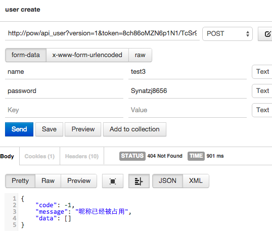
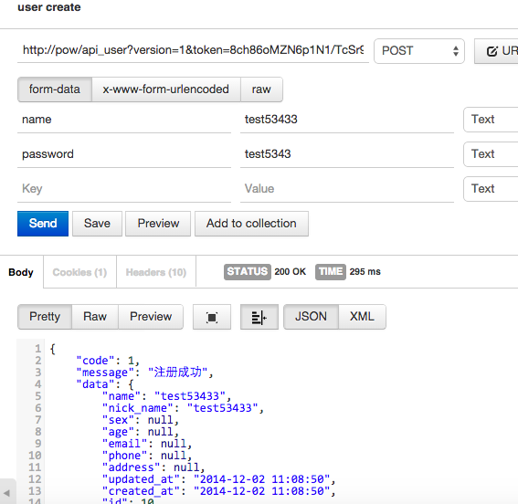
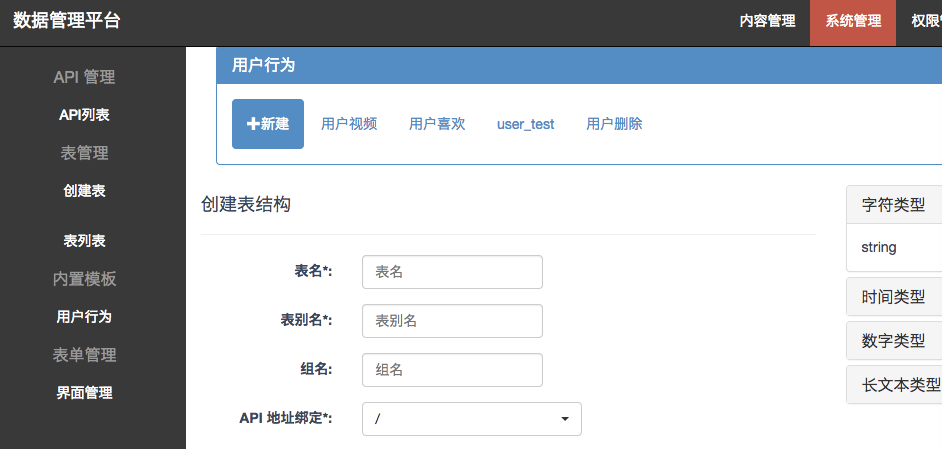

# 用户体系

用户体系是系统内置封装的用户模板 ,实现了

- 用户的登录注册
- 用户发布数据 ,可以简单的理解成用户xx,这个 xx 可以是用户喜欢,用户收藏,用户视频等
- 好友时间线(timeline)  : 就像微博中我关注了一个用户,那么这个用户发布的数据都会出现在自己的页面中(正在做)
- 用户结构定义如下,用户的密码处于安全考虑不会输出,而且服务会自动对密码加密

    {
        "id": //唯一 ID ,
        "name": //用户名称不可重复,
        "nick_name": //用户昵称,
        "sex": //性别,
        "age": //岁数,
        "email": //邮箱,
        "phone": //电话,
        "address": //地址,
        "status": //状态
        "password" //安全考虑此字段不会输出
    }


## 如何调用

### 用户注册[post]

http://domain/api_user?version=1&token=8ch86oMZN6p1N1/TcSr9Fw==

`[post data]`
```
"name": //用户名称不可重复,
"nick_name": //用户昵称,若不传则该值等于 name
"sex": //性别,
"age": //岁数,
"email": //邮箱,
"phone": //电话,
"address": //地址,
"status": //状态
"password" //我们会对密码自动加密保证用户数据安全性

```

举个栗子
 


 


### 获取所有用户 [get]

http://domain/api_user?&token=xxx

返回

```
{
    "code": 1,
    "message": "success",
    "data": [
        {
            "id": 8,
            "name": "test-24-1",
            "nick_name": "test-24-1",
            "sex": "",
            "age": "",
            "email": "",
            "phone": "",
            "address": "",
            "status": ""
        },
      ...
    ]
}
```


### 获取单个用户 [get]
http://domain/api_user/ `用户ID`?&token=xxx

例如
http://domain/api_user/1?&token=xxx
获取用户 ID 是1的用户信息


### 用户名重复检测 [post]

http://domain/api_user/name_check?version=1&token=8ch86oMZN6p1N1/TcSr9Fw==

`[post data]`
```
name:xxxx
```

返回

```
未注册
{
    "code": 1,
    "message": "用户名尚未被注册",
    "data": []
}
已经注册
{
    "code": -1,
    "message": "用户名已经被注册",
    "data": []
}
```


### 用户登录 [post]

http://domain/api_user/login?version=1&token=8ch86oMZN6p1N1/TcSr9Fw==


`[post data]`

```
name:xxxx

password:xxx
```
返回

```
登录成功
{
    "code": 1,
    "message": "登陆成功",
    "data": {
        "id": 7,
        "name": "test5",
        "nick_name": "test5",
        "sex": null,
        "age": null,
        "email": null,
        "phone": null,
        "address": null,
        "status": null
    }
}
登录失败
{
    "code": -1,
    "message": "登陆失败,用户名或者密码错误",
    "data": []
}
```


### 用户发布数据相关

#### 创建用户发布数据


创建用户发布的数据 通过`系统管理->用户行为`
和创建表结构一样,但是pow 对此在背后做了大量的工作来优化用户行为数据的访问


`用户发布的数据的关系只能通过 API 来创建,修改和删除
无法通过界面来操作,即用户是否发布,删除等行为只能通过 API 控制. 但是数据本身还是可以通过界面来修改`


建设我们创建了一张 `用户视频`, 并且我们绑定的 API 是 `user_video`
表的属性只有

`[post data]`
```
name string
imgs string 200
```
接下来我们将演示如何一步步操作 用户视频

### 获取某个用户发布的数据 [get]


在这个场景就是获取用户ID 为1 发布的所有视频

http://domain/user_video?version=1&token=8ch86oMZN6p1N1/TcSr9Fw==& `uid=1`

```
{
    "code": 1,
    "message": "success",
    "data": [
        {
            "name": "星际穿越",
            "imgs" :"",
            "id": 5
        },
     ....
    ]
}

```

### 用户发布一条数据 [post]

这样用户1 就发布了一条测试1数据

http://domain/user_video?version=1&token=8ch86oMZN6p1N1/TcSr9Fw==

`[post data]`
```
uid:1

data:{"name":"测试1"}
```

`或者直接关联到已经创建的数据,如果数据一已经创建可以直接传入数据 id 无需重新创建数据信息`

`[post data]`
```
flag:true
data_id://数据 id
```

### 删除用户发布的数据[post]

`删除只是删除这层关系,但是发布的数据本身是不会删除的,可如果数据需要删除以通过界面管理进行操作`


```
举个栗子
这样的用户场景比如A ,B 两个用户都喜欢了一个电影,
如果 A 用户取消喜欢了这个电影, 后台只是删除了这层关系,并不会把电影删除掉,这不电影依然会出现在 B 用户的喜欢列表,但是不会出现在 A 用户的喜欢的列表中
```

在这里我们删除用户 ID 是1发布的数据 ID 是11的`关系`
操作成功后 这条数据在也不会出现在用户列表中

但是条数据 ID 是11 的数据依然存在


http://domain/user_video/ `1`?version=1&token=8ch86oMZN6p1N1/TcSr9Fw==

`[post data]`
```
data_id : 11
```


