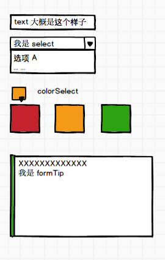
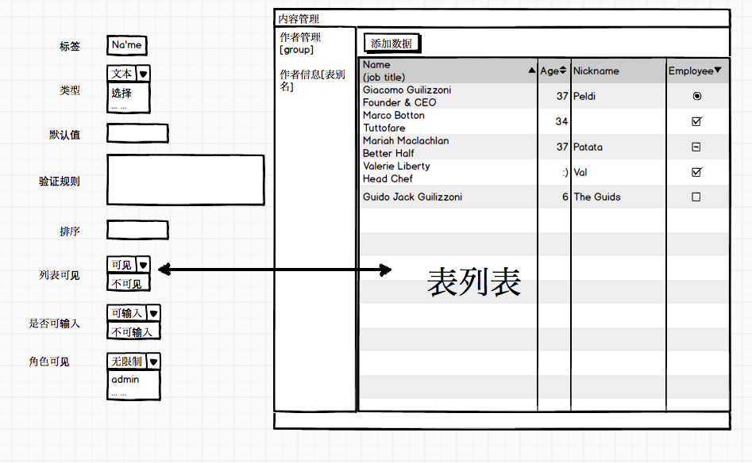

#界面管理

 当我们在表管理这里创建完表之后，就需要为表添加数据，在pow中添加数据有2个办法
 - 在建表的时候绑定路径，开启API访问和创建权限，这样可以通过API 创建数据
 - 为表创建一个数据添加的界面，然后在内容管理中通过界面创建数据

我们推荐第二种,可以提供一个友好的数据管理和编辑界面，可以让少侠亲自参与数据的运营，数据流转，了然于心。

## 界面术语

   `当表创建完成但是还没有创建对应的界面的时候，在这个表的后面有一个 + 的icon 提示少侠需要为数据添加一个界面界面`

 - 标签： 因为字段大部分都是英文和其他组成,为了使用更加方便，可以给字段起一个别名
 - 类型  字段会有很多类型，为了方便操作，我们给对应类型的字段做了相应的控件
  - text： 会在界面上显示文本输入框，适合`string等文本`类型
  - select          会在界面上显示多选控件，选择的值在默认值中设定，多值用`,` 分隔
  - textQuick        会在界面上比较特殊的文本选择控件和`template` 搭配使用，选择的值在默认值中设定，多值用`,(英文半角逗号)` 分隔
  - colorSelect     会在界面上显示颜色选择控件，选择的值在默认值中设定，多值用`,` 分隔
  - formTip         会在界面上显示提示控件，提示的文本由默认值指定

## 和内容管理关系
当少侠在配置完界面管理后就可以在内容管理中操作数据了

大概是这个样子,界面管理可以设置每一个字段在界面上的展现形式或者控制在列表栏是否显示

*注意 只有设置了字段可见才会在列表栏展示此字段*

