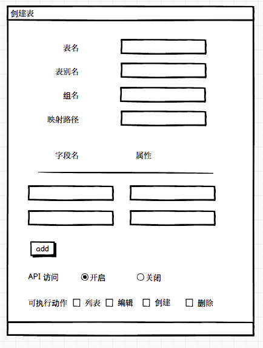
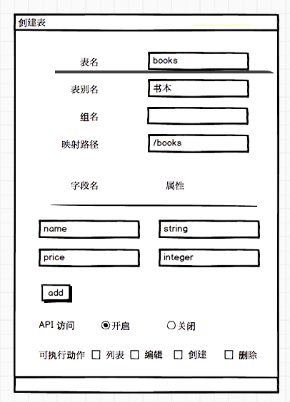
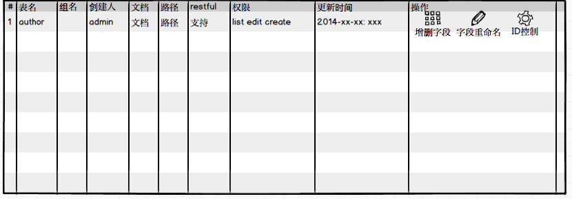

#表格管理


## 天地初开

 表基石也！

 指的是数据库中的表(table)，是数据真正存储的地方。通过我们系统可以让少侠快速的把数据和数据库关联起来，即使少侠一点也不会数据库的知识也没关系，当然会了更好！

在所有的编程武功中都有字符串（string）和数字之分（int），我们的系统也不例外，理论上所有的类型都可以用string，但是这样在客户端解析和数据存储来看
并不不是最上乘。

数据是一个系统的基石，所以这篇我们会着重介绍，如果少侠看的不知所云，那就稍后可以参照我们最后的实践例子，少侠一试便知！


## 界面术语


   * 表名顾名思义表的名称，支持字母，数字和下划线，请不要使用中文和特殊字符，必填
   * 表别名，表的艺名（因为表名大部分是英文和字母，这个地方就可以填写中文啦），在内容管理中显示所用，可以使用中文，必填
   * 组名， 在内容管理中的分组名称，方便显示，可选
   * 映射路径， 在路径管理中我们介绍的，把数据和URL 地址关联起来，如果不希望这个表的数据被外界访问可以选无
   * 字段名 字母数字和下划线构成，这个就是API访问的的字段名称
   * 属性   字段的类型，一旦确定不可修改，稍后我们为少侠详细介绍
   * 如果需要这张表的数据以API的方式对外提供，那么需要选择路径映射，并且勾起`API访问` ，然后选择对应的权限


## 初出茅庐


   字段就是数据实体（API）返回的一些字段，属性就是这些字段的类型，字段和属性在实际并无一一对应关系

   这里我们讲介绍系统的4大基础属性，掌握了这些基础字段，就可以尝试建立一些常规的接口，给客户端使用。

* 第一式 `string` 适用于标题，名称，图片等中短文本类型，string 支持长度设定默认是45个字符，你可以通过 string N （N>0）来增加默认的文本长度,如果输入的文本超过了默认长度限定
数据将会被默认截断，如果你实在不知道用多长合适那就直接用 `string 200` 吧

* 第二式 `text` 适用于大型文本， 例如文章，简介等，这个不能指定长度

* 第三式 `integer` 适用于各种id，但是有一点要注意数据的长度不要超过11位 或者数值在 -2^31 (-2,147,483,648) 到 2^31 – 1 (2,147,483,647)之间，不然数据会不正常的，然后你整个人就不好了。对于含有小数点的可以用double或者decimal

* 第四式 `datetime`  适用于时间返回的格式 yyyy-mm-dd h:i:s 例如（2014-04-21 12:00:00）


### 举个简单的示例



这里我们创建了一个books 表，绑定了在前面创建的books 路径，然后填写了一个string 类型的name，和一个integer类型的price（这个地方用double更加合适），并且开启了API 的访问,(假设这些都操作顺利,然后我们通过一些途径添加了不少数据)

那么我们API访问将会是这样

```
http://domain/books
{
  "code": 1
  "message": "successful"
  "data":[
   {
      "id" : 1,
      "name" : "三国演义"，
      "price": 30
   },
   {
      "id" : 2,
      "name" : "水浒传"，
      "price": 20
   },
   ... ...
  ]
}
```

更加强力的API 我们讲在稍后细致的介绍，少侠勿急

## 登堂入室

恭喜少侠已经可以出入江湖了，去围观下武林大赛什么的，倘若想去一争搞下，你需要更厉害的上乘功法，这个请少侠放心，不要998，只需要耐心往下看即可

* 系统内置字段 当你建表的时候系统会默认加上`id,user_name，timing_state，timing_time，created_at，updated_at，deleted_at` 这些字段，所以
你新增字段的时候不能使用这些字段，这些字段的数据都是自动记录所以你可以放心使用

* 数据的默认值 倘若你需要一个字在创建的时候就有一个默认值，那么你只需要用`|` 即可
例如 `img string 200 ` ,这里我们创建了一个长度为200的img字段，若img创建的时候希望有一个xxx.png的默认值，那么创建的时候可以这样 `img string 200|xxx.png`
这个会在后面有妙用，请少侠牢记


## 游历四方

到了这里恭喜少侠已经经过了最艰难的旅途，可以开创属于自己的江湖传说了，不过闯荡江湖前，少侠需做充分的准备，不然传说就会变成戏说了

* 表一旦建立成功，不允许删除,删除太危险,恩我们给干掉了,但是字段可以删除
* 在表列表界面允许新增,删除字段,表的字段名字填写错了没有关系可也可以在这个地方修改，但是字段的属性一旦建立就不允许修改
* 每个表都有一个主键和索引一般都是数据的ID，根据ID来查数据是飞一般的速度

`同时我们也回顾下这些有特殊意义的字段，归纳和整理是很重要的`


|关键字|说明|示例|
|------|---|---|
|ID|数据唯一标示|1
|deleted_at|删除时间|2013-12-17 10:41:34
|updated_at|更新时间|2013-12-17 10:41:34
|created_at|创建时间|2013-12-17 10:41:34
|timing_time|数据定时时间|2013-12-17 10:41:34
|timing_state|数据状态|1
|user_name|修改人|xxxx
|children| 集合属性|videos:special_video(字段:表名)
|parent| 集合属性|videos:special:1(字段:表名:id)
|rank| 排序|1395373666
|template| 模板|表名，表名
|action_limit| 输出限定条件 |version:<:3 (version 参数小于3),支持<,>,=,<=,>=
|action_flag| 输出限定动作 | display(不显示) 或者 title:1 (设定title =1)

## 表列表

   在表列表界面我们会看到我们创建的表的信息，有这个表的调用方式（如果绑定了路径的话），访问权限和表的属性结构等，同时在这个地方我们可以新增字段，
   修改字段名,这些地方和前面的一样，少侠一试便知



